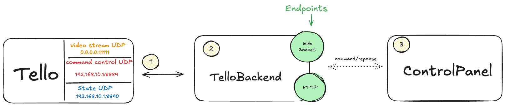

# Tello Web Command Panel


This project provides a web interface for controlling the DJI Tello drone. It extends
the [DJITelloPy](https://github.com/damiafuentes/DJITelloPy) Python library by exposing HTTP and WebSocket endpoints for
drone control. Initially, WebSocket was the primary focus due to its full-duplex communication capabilities, which are
ideal for fast telemetry data transfer. However, HTTP became the main protocol due to its simplicity and fewer issues
with connection management during React re-renders. The HTTP implementation is straightforward, without long polling or
other advanced techniques.

## Credits

- **DJITelloPy**: Most of the backend logic is forked from the [DJITelloPy](https://github.com/damiafuentes/DJITelloPy)
  library.

## How It Works



1. **Drone Connection**: The Tello drone creates a Wi-Fi network. The device running this program connects to this
   network. The drone has a UDP server that listens for commands on the following addresses and ports:
    - **Tello IP Address**: `192.168.10.1`
    - **Video Stream**: `0.0.0.0:11111`
    - **Control**: `192.168.10.1:8889`
    - **State**: `192.168.10.1:8890`

2. **Tello Model**: The Tello model handles the logic for sending commands to the drone and receiving state data. This
   model exposes endpoints for these operations.

3. **Web Interface**: The web interface sends HTTP requests to the server, which then forwards the commands to the
   drone.

## How to Run

### Prerequisites

1. Ensure your computer is connected to the Tello drone's Wi-Fi network.
2. Install Node.js version 21.x.
3. Install Python 3.12.

### Running the Backend

1. **Install Dependencies**:
   ```bash
   pipenv install
   ```

2. **Run the Flask Server**:
   Execute the following command from the backend directory. Note that on macOS, port 5000 is reserved for AirTunes.
   ```bash
   FLASK_APP=src/main.py flask run --port=5001 --debug
   ```

### Running the Frontend

1. **Install Dependencies**:
   This project uses `pnpm`, but you can use `npm` or `yarn` if preferred.
   ```bash
   pnpm install
   ```

2. **Run the Frontend**:
   ```bash
   pnpm run dev
   ```

3. **Access the Web Interface**:
   Open your browser and navigate to the endpoint displayed in the terminal to access the web interface.

## Nice to haves

- **Code cleanup**: Refactor the codebase to improve readability and maintainability.
- **WebSocket Integration**: Reintroduce WebSocket support for real-time communication.
- **Video Streaming**: Add support for live video streaming from the drone.
- **Advanced Controls**: Implement more advanced drone controls and flight patterns.
- **Mobile Support**: Optimize the web interface for mobile devices.
